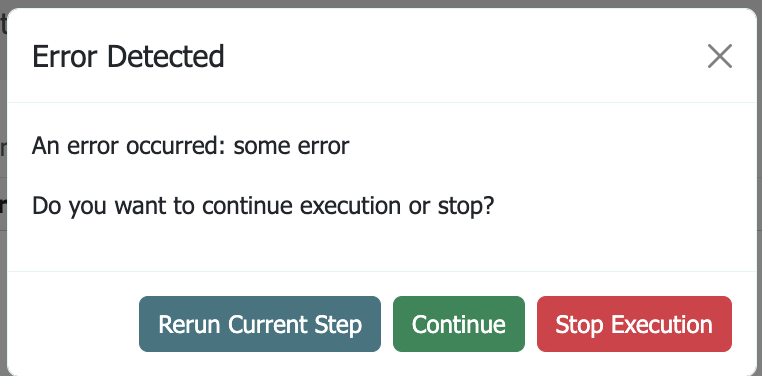
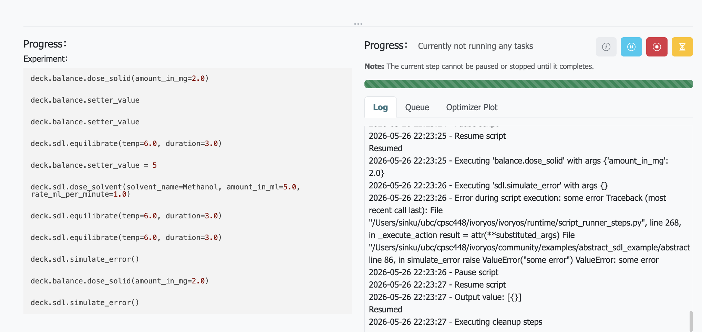

### General Notes from Paper:
* Adoption and transferability limited by the lack of standardized software across diverse SDLs.
* plug-and-play/low-code in order to lower barrier to entry for SDLs
* custom scripts are often needed to orchestrate hardware
* Previous work:
  * ChemIDE
  * AlabOS
  * ChemOS 2.0
* Tested in six SDLs across two labs
* Architecture uses Flask

Read up until the workflow execution portion

### Implementation Notes
* Is a login necessary if it's being run locally? Is this just to secure the application from others on the same network?
* Hardware is defined as balance, pump, or SDL
  * A better design would have present hardware and you could create instruments that are in your lab using the predefined hardware classes
* Creating an experiment then allowing someone to run it X number of times may not be very intuitive. Should have one overarching descriptor and sub-components within this
  * e.g. an experiment contains processes and the processes can happen X number of times. This makes it more modular and adds the prep, and clean up into the experiment itself.
* What's the purpose of `if`, `while`, `variable`, and `wait`. These are too low level and the experiment orchestration should not rely on this psuedocode-like controls
* CSV file for data entry is not very user friendly
* 
* 
* Different items have different names for the location
  * Not defining x,y,z as the location but rather abstracted names such as A1
  * In the new design there should be a way to map different semantic naming for locations to the actual cartesian coordinates
* IvoryOS is a thin web-based UI layer meant to control python scripts
* Control of the robots is completely separate from IvoryOS (this is done with different python scripts)
* abstract_sdl.py is simply an example of what can be run, but users would instead write their own scripts that call the entry point into IvoryOS (`ivoryos.run(__name__)`)